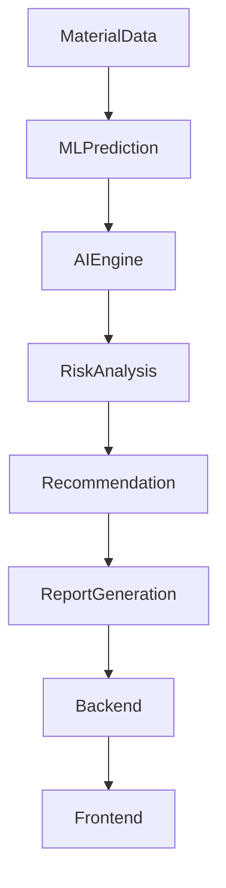

# AI Module Documentation

## Folder

ai/

## Filename

ai-module.md

## Purpose

This document describes the Artificial Intelligence module of MatterMind, including its objectives, workflow, capabilities, and integration with the Machine Learning pipeline.

---

# Overview

The AI module enhances the intelligence of MatterMind by transforming Machine Learning predictions into actionable insights and recommendations. It interprets prediction results, explains risks, and provides decision support for engineers, manufacturers, and quality assurance teams.

Unlike the ML module, which focuses on prediction, the AI module focuses on reasoning, interpretation, and intelligent recommendations.

---

# Responsibilities

The AI module is responsible for:

- Intelligent material analysis
- Recommendation generation
- Risk interpretation
- Decision support
- Report summarization
- Explainability of predictions
- Future conversational AI support

---

# AI Workflow

---

# Input

The AI module receives:

- Material Properties
- Compatibility Score
- Remaining Useful Life
- Risk Assessment
- Historical Material Data
- User Preferences (Future)

---

# AI Processing

The AI engine performs:

- Context Analysis
- Prediction Interpretation
- Rule-Based Validation
- Recommendation Generation
- Confidence Analysis
- Report Preparation

---

# Outputs

The AI module generates:

- Material Recommendation
- Reuse Suggestions
- Risk Explanation
- Decision Summary
- Confidence Level
- Maintenance Advice
- Sustainability Insights

---

# Recommendation Levels

The AI module categorizes recommendations into:

| Level | Description |
|--------|-------------|
| Approve | Material is suitable for reuse |
| Recondition | Material requires treatment before reuse |
| Reject | Material is not safe for reuse |
| Further Inspection | Additional testing is recommended |

---

# Explainable AI

MatterMind aims to provide transparent recommendations by:

- Explaining prediction results
- Highlighting influential features
- Displaying confidence scores
- Providing human-readable reports

---

# Future AI Features

Planned enhancements include:

- Large Language Model (LLM) integration
- Conversational AI Assistant
- Natural Language Report Generation
- Voice-based Queries
- Smart Material Suggestions
- AI-powered Search
- Automated Documentation

---

# Integration

The AI module interacts with:

- Backend
- Machine Learning Module
- Database
- Frontend

Workflow:

Frontend → Backend → ML → AI → Backend → Frontend

---

# Design Principles

The AI module follows these principles:

- Explainability
- Transparency
- Accuracy
- Scalability
- Reliability
- Human-Centered Decision Support

---

# Status

Current Status: Planned

This documentation will be updated as the AI module is implemented.