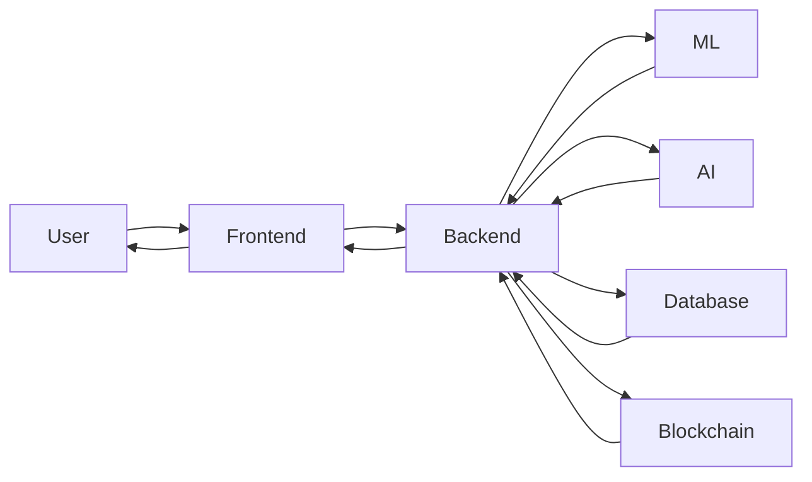
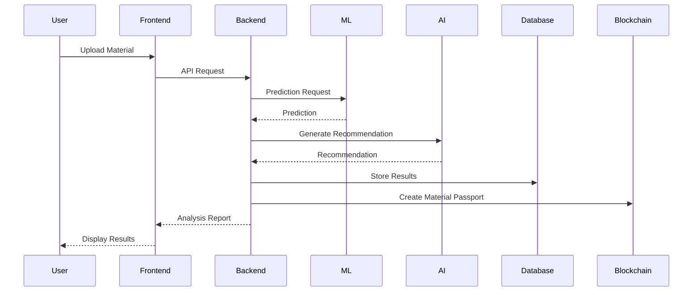

# Project Architecture

## Folder

docs/

## Filename

architecture.md

## Purpose

This document provides a high-level overview of the MatterMind architecture, explaining how different modules interact and how data flows throughout the system.

---

# Overview

MatterMind is an AI-powered Material Intelligence Platform that helps industries analyze materials, predict compatibility, estimate remaining useful life, and maintain secure digital material passports.

The platform integrates Machine Learning, Artificial Intelligence, Blockchain, and a modern web application to deliver intelligent material analysis.

---

# System Components

The platform consists of the following major components:

## Frontend

- User Interface
- Dashboard
- Material Upload
- Reports
- Visualization

---

## Backend

- REST APIs
- Authentication
- Business Logic
- Data Validation
- Communication with AI and ML modules

---

## AI Module

Responsible for:

- Material Analysis
- Recommendation Generation
- Intelligent Insights
- Future LLM Integration

---

## Machine Learning Module

Responsible for:

- Compatibility Prediction
- Remaining Useful Life Prediction
- Risk Assessment
- Model Inference

---

## Blockchain Module

Responsible for:

- Digital Material Passport
- Immutable Material Records
- Traceability
- Verification

---

## Database

Responsible for storing:

- Users
- Materials
- Reports
- Predictions
- Blockchain References

---

# Overall Workflow

1. User uploads material information.
2. Frontend sends the request to the Backend.
3. Backend validates the data.
4. Backend forwards data to the ML module.
5. ML predicts compatibility and remaining life.
6. AI generates recommendations.
7. Backend stores results in the database.
8. Blockchain records a secure material passport.
9. Results are displayed on the dashboard.

---

# High-Level System Architecture

---

# Component Communication

---

# Folder Responsibilities

| Folder | Responsibility |
|---------|---------------|
| assets | Project branding and visual resources |
| backend | APIs and business logic |
| frontend | User interface |
| ml | Machine learning models |
| docs | Project documentation |

---

# Future Architecture

The architecture is designed to support future enhancements, including:

- IoT sensor integration
- Real-time monitoring
- Multi-model AI support
- Cloud-native deployment
- Mobile application
- Enterprise integrations
- Advanced analytics dashboard

---

# Design Principles

The architecture follows the following principles:

- Modular Design
- Scalability
- Maintainability
- Security
- Reusability
- Extensibility
- Separation of Concerns
- API-First Development

---

# Status

Current Version: Draft 1.0

This document will be updated as the project architecture evolves.