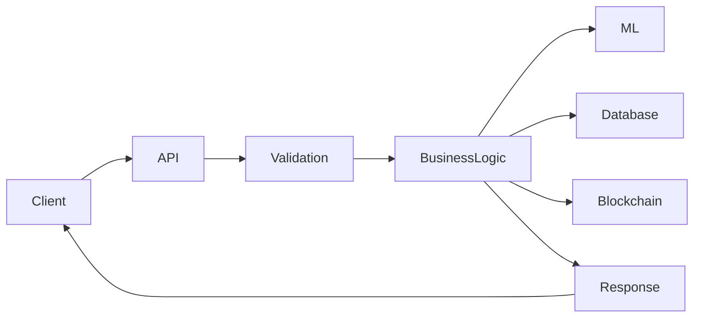

# Backend Documentation

## Folder

backend/

## Filename

backend.md

## Purpose

This document describes the backend architecture, responsibilities, project structure, and future development plans for MatterMind.

---

# Overview

The MatterMind backend serves as the central communication layer between the frontend, machine learning models, future AI services, blockchain components, and the database.

It exposes APIs, validates incoming requests, processes business logic, and coordinates responses to users.

---

# Responsibilities

The backend is responsible for:

- Handling API requests
- Processing business logic
- Validating user input
- Communicating with ML models
- Managing authentication
- Storing and retrieving data
- Integrating with blockchain services
- Returning analysis reports to the frontend

---

# Current Folder Structure

```
backend/
│
├── app/
├── main.py
├── .env.example
├── requirements.txt
└── README.md
```

---

# Directory Description

## app/

Contains the core backend application source code including routes, services, utilities, and business logic.

---

## main.py

Application entry point.

Responsible for:

- Initializing the application
- Starting the web server
- Registering routes
- Loading configuration

---

## requirements.txt

Lists all required Python dependencies for the backend.

---

## .env.example

Provides a template for environment variables required by the backend.

Example variables may include:

```
DATABASE_URL=
SECRET_KEY=
JWT_SECRET=
API_KEY=
MODEL_PATH=
```

---

# Planned API Structure

The following endpoints are expected during development.

| Method | Endpoint | Purpose |
|---------|----------|---------|
| GET | / | Health Check |
| POST | /api/material/analyze | Analyze material |
| GET | /api/material/history | Retrieve analysis history |
| POST | /api/auth/login | User authentication |
| POST | /api/auth/register | User registration |
| GET | /api/report/{id} | Fetch generated report |

*Note: Endpoint names are placeholders and may change during implementation.*

---

# Backend Workflow



---

# Error Handling

The backend should:

- Validate incoming requests
- Return meaningful HTTP status codes
- Log server errors
- Handle unexpected exceptions gracefully

---

# Security Considerations

Recommended security practices include:

- JWT Authentication
- Environment variable management
- Password hashing
- HTTPS communication
- Input validation
- Rate limiting
- Secure API access

---

# Future Enhancements

Planned improvements include:

- Role-based access control
- API versioning
- Background task processing
- Caching
- Monitoring and logging
- Docker deployment
- CI/CD integration

---

# Status

Current Status: Under Development

This document will be updated as backend implementation progresses.