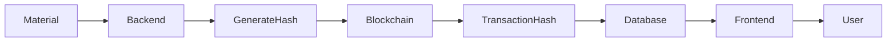

# Blockchain Documentation

## Folder

blockchain/

## Filename

blockchain.md

## Purpose

This document describes the blockchain architecture, workflow, responsibilities, and future implementation strategy of the MatterMind platform.

---

# Overview

MatterMind uses blockchain technology to create secure, tamper-proof digital material passports. Every analyzed material can have a verifiable blockchain record that stores its lifecycle information, ownership history, and verification status.

Blockchain ensures transparency, traceability, and trust across the entire material lifecycle.

---

# Objectives

The blockchain module aims to:

- Create immutable material records
- Improve traceability
- Prevent data tampering
- Enable transparent verification
- Maintain ownership history
- Support sustainability initiatives

---

# Why Blockchain?

Traditional databases allow records to be modified.

Blockchain provides:

- Immutable storage
- Transparent history
- Cryptographic security
- Trust without relying on a single authority
- Easy verification of material authenticity

---

# Responsibilities

The blockchain module is responsible for:

- Creating Digital Material Passports
- Recording analysis history
- Storing verification hashes
- Tracking ownership changes
- Maintaining audit trails

---

# Workflow

---

# Material Passport

Each material may contain:

- Material ID
- Material Type
- Analysis Date
- Compatibility Score
- Remaining Useful Life
- Risk Level
- Verification Status
- Blockchain Transaction Hash

---

# Blockchain Components

## Smart Contracts

Responsible for:

- Material registration
- Verification
- Ownership transfer
- Audit logging

---

## Distributed Ledger

Stores immutable transaction history.

---

## Transaction Hash

Provides a unique identifier for each blockchain record.

---

# Verification Process

1. Material is analyzed.
2. Backend generates a secure hash.
3. Hash is stored on the blockchain.
4. Transaction Hash is returned.
5. Database stores the reference.
6. Users can verify authenticity.

---

# Benefits

- Transparency
- Security
- Traceability
- Tamper Resistance
- Improved Trust
- Better Compliance

---

# Future Enhancements

Planned improvements include:

- NFT-based Material Passports
- Multi-chain Support
- Smart Contract Automation
- Carbon Credit Tracking
- Supply Chain Integration
- IoT Device Integration

---

# Challenges

Potential challenges include:

- Transaction Costs
- Network Latency
- Scalability
- Smart Contract Security
- Regulatory Compliance

---

# Status

Current Status: Planned

Blockchain integration will be implemented in future development phases.