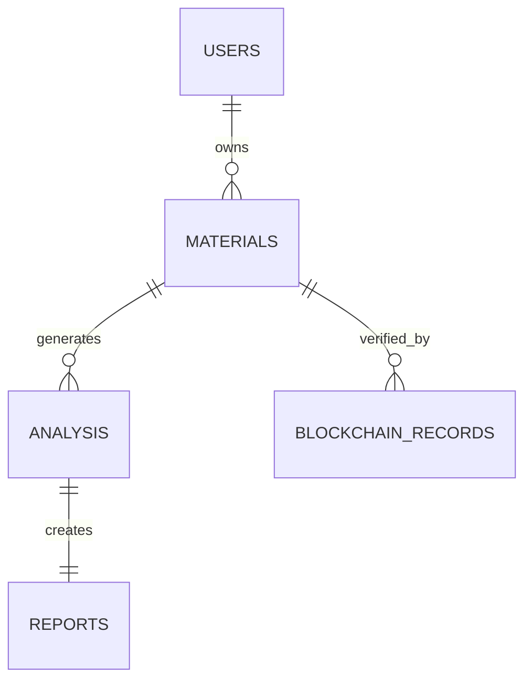
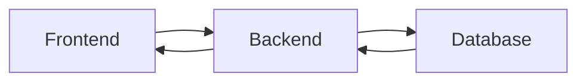

# Database Documentation

## Folder

database/

## Filename

database.md

## Purpose

This document describes the database architecture, data organization, storage strategy, and future database design for the MatterMind platform.

---

# Overview

The database serves as the central repository for storing users, material records, machine learning predictions, reports, blockchain references, and application metadata.

It ensures secure, scalable, and efficient storage while supporting data retrieval for analysis and reporting.

---

# Responsibilities

The database is responsible for:

- Storing user information
- Managing material records
- Saving analysis results
- Maintaining prediction history
- Linking blockchain records
- Supporting report generation
- Managing application metadata

---

# Planned Database Structure

The database will include the following primary entities:

- Users
- Materials
- Material Analysis
- Reports
- Blockchain Records
- Activity Logs

---

# Entity Relationship Diagram

---

# Planned Tables

## Users

Stores registered user information.

Example Fields:

- User ID
- Name
- Email
- Password Hash
- Role
- Created At

---

## Materials

Stores uploaded material details.

Example Fields:

- Material ID
- Material Name
- Material Type
- Grade
- Density
- Hardness
- Upload Date

---

## Analysis

Stores ML prediction results.

Example Fields:

- Analysis ID
- Compatibility Score
- Risk Level
- Remaining Useful Life
- Confidence Score
- Timestamp

---

## Reports

Stores generated reports.

Example Fields:

- Report ID
- Analysis ID
- Recommendation
- Report Status
- Generated Date

---

## Blockchain Records

Stores blockchain transaction references.

Example Fields:

- Transaction Hash
- Block Number
- Verification Status
- Timestamp

---

# Data Flow

---

# Database Operations

The system performs:

- Create
- Read
- Update
- Delete (where applicable)
- Search
- Filtering
- Reporting

---

# Security Considerations

Recommended practices include:

- Password Hashing
- Data Encryption
- Secure Connections
- Access Control
- Backup Strategy
- Audit Logging

---

# Scalability

The database is designed to support:

- Large material datasets
- Concurrent users
- Historical records
- Future analytics modules

---

# Future Improvements

Planned enhancements include:

- Distributed Database Support
- Data Versioning
- Automatic Backups
- Real-time Synchronization
- Data Warehousing
- Advanced Indexing

---

# Status

Current Status: Planned

The database schema and ER diagram will be updated once backend development is finalized.