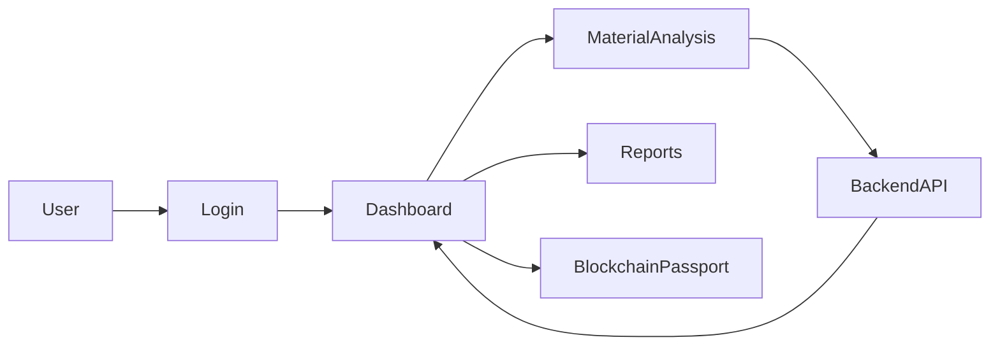

# Frontend Documentation

## Folder

frontend/

## Filename

frontend.md

## Purpose

This document describes the frontend architecture, responsibilities, user interface, and communication with the backend for MatterMind.

---

# Overview

The MatterMind frontend provides an intuitive, responsive, and user-friendly interface that allows users to upload material information, view AI-powered analysis, access historical reports, and manage their digital material passports.

The frontend communicates with the backend through REST APIs and presents the processed information in an interactive dashboard.

---

# Responsibilities

The frontend is responsible for:

- User Authentication
- Material Data Submission
- Dashboard Visualization
- Report Display
- Blockchain Passport View
- User Profile Management
- Responsive User Experience

---

# Planned Folder Structure

```
frontend/
│
├── public/
├── src/
│   ├── components/
│   ├── pages/
│   ├── services/
│   ├── assets/
│   ├── hooks/
│   ├── utils/
│   └── App.js
│
├── package.json
└── README.md
```

---

# Main Pages

## Home

Displays the project overview and allows users to begin material analysis.

---

## Login

Secure authentication page for registered users.

---

## Dashboard

Displays:

- Recent analyses
- Material statistics
- AI recommendations
- Reports

---

## Material Analysis

Allows users to:

- Upload material details
- Submit analysis requests
- View compatibility predictions

---

## Reports

Displays:

- Analysis Summary
- Risk Assessment
- Remaining Useful Life
- Recommendations

---

## Blockchain Passport

Displays:

- Material ID
- Ownership History
- Verification Status
- Blockchain Hash

---

# Frontend Workflow



---

# Communication with Backend

The frontend communicates with the backend using REST APIs.

Typical workflow:

1. User submits material data.
2. Frontend sends API request.
3. Backend processes request.
4. Backend returns prediction.
5. Frontend displays results.

---

# UI Components

The application consists of reusable components such as:

- Navigation Bar
- Sidebar
- Material Upload Form
- Report Cards
- Dashboard Widgets
- Charts
- Tables
- Notification System
- Footer

---

# Responsive Design

The frontend is designed to support:

- Desktop
- Laptop
- Tablet
- Mobile Devices

---

# Future Enhancements

Planned frontend improvements include:

- Dark Mode
- Real-time Notifications
- Advanced Charts
- Interactive Material History
- Multi-language Support
- Accessibility Improvements
- Offline Support

---

# Design Principles

The frontend follows these principles:

- Clean UI
- Responsive Design
- Component Reusability
- Accessibility
- Performance Optimization
- User-Centered Design

---

# Status

Current Status: Under Development

This document will be updated as the frontend implementation evolves.