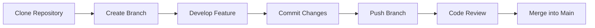

# Git Workflow

## Folder

docs/

## Filename

git-workflow.md

## Purpose

This document defines the Git workflow followed by the MatterMind development team. It ensures organized collaboration, minimizes merge conflicts, and maintains a clean project history.

---

# Overview

All development should be performed using feature branches. Direct commits to the `main` branch should be avoided unless approved by the project lead.

---

# Branch Structure

The project follows the following branch strategy:

```
main
│
├── feature/<feature-name>
├── bugfix/<bug-name>
├── docs/<documentation-task>
└── hotfix/<issue-name>
```

### Examples

```
feature/frontend-dashboard

feature/material-analysis

feature/backend-authentication

bugfix/login-validation

docs/update-readme

docs/architecture
```

---

# Development Workflow

## Step 1

Pull the latest changes from the main branch.

```bash
git pull origin main
```

---

## Step 2

Create a new branch for your assigned task.

```bash
git checkout -b feature/your-feature
```

Example:

```bash
git checkout -b docs/documentation
```

---

## Step 3

Complete your assigned work.

---

## Step 4

Check modified files.

```bash
git status
```

---

## Step 5

Stage the changes.

```bash
git add .
```

or

```bash
git add <filename>
```

---

## Step 6

Commit your work.

```bash
git commit -m "docs: update architecture documentation"
```

Examples:

```bash
git commit -m "feat: implement dashboard"

git commit -m "fix: resolve login issue"

git commit -m "docs: add deployment guide"
```

---

## Step 7

Push your branch.

```bash
git push origin docs/documentation
```

---

## Step 8

Create a Pull Request (if followed by the team) or request a review before merging.

---

# Commit Message Convention

Use the following prefixes:

| Prefix | Purpose |
|---------|----------|
| feat | New feature |
| fix | Bug fix |
| docs | Documentation |
| refactor | Code improvement |
| style | Formatting changes |
| test | Testing |
| chore | Maintenance |

---

# Best Practices

- Pull the latest changes before starting work.
- Work on only one feature per branch.
- Commit frequently with meaningful messages.
- Keep commits focused and small.
- Review your changes before pushing.
- Resolve merge conflicts carefully.
- Never commit secrets, API keys, or passwords.

---

# Merge Guidelines

Before merging:

- Ensure the project builds successfully.
- Verify your changes locally.
- Update documentation if required.
- Resolve merge conflicts.
- Obtain approval from the project lead or reviewer if applicable.

---

# Common Git Commands

Clone Repository

```bash
git clone <repository-url>
```

Check Branch

```bash
git branch
```

Switch Branch

```bash
git checkout branch-name
```

View Status

```bash
git status
```

View Commit History

```bash
git log
```

Fetch Latest Changes

```bash
git fetch
```

Pull Latest Changes

```bash
git pull origin main
```

Push Changes

```bash
git push origin branch-name
```

---

# Workflow Diagram



---

# Status

This Git workflow may be updated as the MatterMind development process evolves.