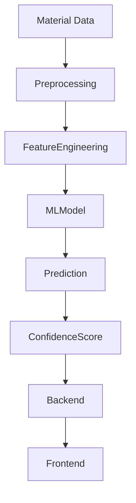

# Machine Learning Module Documentation

## Folder

ml/

## Filename

ml-module.md

## Purpose

This document describes the Machine Learning module of MatterMind, including its objectives, workflow, model lifecycle, data processing, and future improvements.

---

# Overview

The Machine Learning module is responsible for analyzing material properties and generating predictive insights that assist engineers and manufacturers in making informed decisions about material reuse.

The module processes material characteristics, evaluates compatibility, estimates remaining useful life, and predicts potential risks.

---

# Responsibilities

The ML module is responsible for:

- Material compatibility prediction
- Remaining Useful Life (RUL) estimation
- Risk assessment
- Feature engineering
- Model inference
- Prediction confidence scoring

---

# ML Workflow

---

# Input Features

The model may use features such as:

- Material Type
- Material Grade
- Density
- Hardness
- Tensile Strength
- Corrosion Level
- Thermal Exposure
- Previous Usage
- Manufacturing Process
- Environmental Conditions

---

# Data Preprocessing

Before prediction, the data undergoes preprocessing:

- Missing value handling
- Data validation
- Feature normalization
- Feature scaling
- Data transformation
- Feature selection

---

# Model Pipeline

The prediction pipeline consists of:

1. Data Collection
2. Data Cleaning
3. Feature Engineering
4. Model Inference
5. Confidence Calculation
6. Prediction Generation
7. Result Delivery

---

# Expected Outputs

The ML module generates:

- Compatibility Score
- Risk Level
- Remaining Useful Life
- Confidence Score
- Recommendation Support Data

---

# Model Evaluation

Typical evaluation metrics include:

- Accuracy
- Precision
- Recall
- F1 Score
- ROC-AUC
- Mean Absolute Error (MAE)
- Root Mean Square Error (RMSE)

The exact metrics depend on the prediction task.

---

# Integration

The ML module communicates with the backend through internal APIs or service calls.

Workflow:

Frontend → Backend → ML Module → Backend → Frontend

---

# Future Improvements

Planned enhancements include:

- Deep Learning Models
- AutoML Integration
- Continuous Model Retraining
- Explainable AI (XAI)
- Multi-material Prediction
- Ensemble Learning
- Real-time Prediction Pipeline

---

# Challenges

Potential challenges include:

- Data Quality
- Model Bias
- Generalization
- Limited Industrial Datasets
- Model Drift

---

# Status

Current Status: Under Development

The Machine Learning module documentation will evolve alongside model development.